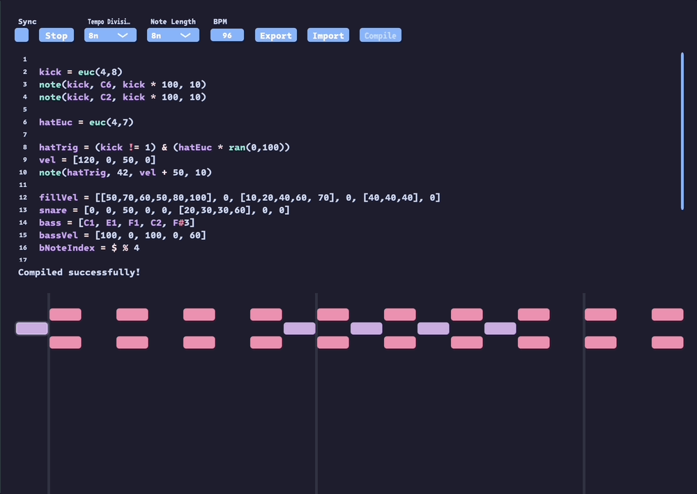

# ORchestra

[](https://github.com/Tronhjem/ORchestra/actions/workflows/Build.yml)
[](https://github.com/Tronhjem/ORchestra/actions/workflows/RunTests.yml)

## Overview

ORchestra is a powerful MIDI sequencer plugin that generates and combines sequences using euclidean algorithms or manual input. It features a custom scripting language for creating complex rhythmic patterns through logical operations. The ORchestra language does not aim to be a completel programming language, and have been created to fit the need of the specific vision for ORchestra.
There's many other live coding tools out there, and it's also not trying to replace these. Rather, this is my brain child and idea of what a fun experimental midi scripting lanaguage inside a DAW should do, and invites for experimenting with phasing loops to create semi algorithmic small compositions or patterns. 

The original prototype that sparked the idea can be found here: <https://github.com/Tronhjem/EuclidsCombinator>

> **Disclaimer:** AI has been used on this project to try out new features like github copilots agents on git, by implementing simple extensions of the lanugage, and writing unit tests etc. Majority of the code is still written by me and this is by no means a vibe coded project. 

### Key Features

- **Euclidean Rhythm Generation**: Create rhythmic patterns using the euclidean algorithm
- **Sequence Combination**: Use logic operations (`&`, `^`, `|`) to combine sequences
- **Phasing Patterns**: Sequences of different lengths phase and evolve over time
- **Custom Scripting Language**: Powerful yet simple syntax for defining musical patterns
- **MIDI Output**: Generates MIDI notes and CC messages
- **Mathematical Operations**: Full arithmetic support with standard precedence
- **Comparison Operators**: Compare values and create conditional patterns



---

## Table of Contents

- [Prerequisites](#prerequisites)
- [Quick Start](#quick-start)
- [Build Instructions](#build-instructions)
- [Running Tests](#running-tests)
- [Syntax and Language Reference](#syntax-and-language-reference)
  - [Operators](#operators)
  - [Variables](#variables)
  - [Reserved Keywords](#reserved-keywords)
  - [Data Sequences](#data-sequences)
  - [Substeps / Sub-divisions](#substeps--sub-divisions)
  - [Note Values](#note-values)
  - [Tracks](#tracks)
  - [Built-in Functions](#built-in-functions)
- [Examples](#examples)
- [Troubleshooting](#troubleshooting)

---

## Prerequisites

Before building ORchestra, ensure you have the following installed:

- **CMake** (version 3.22 or higher)
- **C++ Compiler** with C++17 support (GCC, Clang, or MSVC)
- **Git** (for cloning and managing submodules)
- **JUCE Framework** (automatically fetched as a git submodule)

---

## Quick Start

You can run this wiht the Projucer, and generate a proejct and build it, which is by far the easiest if you do not want to deal with CMake.

else, you can get started is using the provided setup script:
```bash
./setup.sh
```

This will:
1. Initialize and update the JUCE submodule
2. Create a build directory
3. Configure CMake with default settings

Then build the project:
```bash
cd build
cmake --build .
```

---

## Build Instructions

### Manual Build Process

**Step 1: Clone and Initialize Submodules**

```bash
git clone https://github.com/Tronhjem/ORchestra.git
cd ORchestra
git submodule update --init --recursive
```

**Step 2: Create Build Directory**

```bash
mkdir build
cd build
```

### Build Options

The CMake build supports separate compilation of the plugin and tests for faster development:

**Build tests only (no JUCE dependency, faster):**
```bash
cmake -DBUILD_PLUGIN=OFF -DBUILD_TESTS=ON ..
cmake --build .
./UnitTests/ORchestraTests
```

**Build plugin only (requires JUCE):**
```bash
cmake -DBUILD_PLUGIN=ON -DBUILD_TESTS=OFF ..
cmake --build .
```

**Build both (default):**
```bash
cmake ..
cmake --build .
```

---

## Running Tests

Tests use the Catch2 framework and can be built independently from the JUCE plugin.
This allows for quick test iterations without compiling the entire JUCE framework.

```bash
cd build
cmake -DBUILD_PLUGIN=OFF -DBUILD_TESTS=ON ..
cmake --build .
./UnitTests/ORchestraTests
```

---

## Syntax and Language Reference

The ORchestra scripting language is evaluated from top to bottom.
You must declare variables before using them later in the script.

**Best Practice:** Define data sequences first, then create tracks that use them.

### General Rules

- Each new line is a new instruction (uses `\n` as delimiter)
- All whitespace within a line is ignored
- Use `//` for single-line comments
- All values are 8-bit integers, limited to 0-127 for MIDI compatibility

### Operators

**Arithmetic Operators**

`+` `-` `*` `/` `%` operate on numbers with standard mathematical precedence.
Parentheses can be used to override precedence, just like in regular programming.
All arithmetic operators take precedence over logical and comparison operators.

**Logical Operators**

`|` `^` `&` evaluate logic operations on triggers (values > 0 are true).
These operators always return 0 (false) or 1 (true).

**Comparison Operators**

`>` `<` `>=` `<=` `==` `!=` compare two values and return 0 (false) or 1 (true).

### Variables

The `=` operator declares and assigns a variable.

**Declaration Syntax:**
- Variable names can be any length
- Must start with an alphabetic character or `_`
- Cannot start with a number

**Assignment Examples:**

**Simple value:**
```cpp
a = 64
```

**Expressions:**
```cpp
a = 64 + 2
c = a | 1
z = a * (2 + 4)
```

**Data sequence:**
```cpp
a = [127, 0, 64]
```
see for more details [Data Sequences](#data-sequences)

**Variable reference:**

References another variable. If it's a sequence, it evaluates at the current global step.
```cpp
c = [64, 64, 64]
a = c  // References the sequence c
```

**Array indexing:**

Access specific values in a data sequence (zero-indexed):
```cpp
c = [64, 65, 70]
a = c[0]  // value is 64
x = c[1]  // value is 65
```

**Array index assignment:**

Set specific values in a data sequence:
```cpp
c = [64, 65, 70]
c[0] = 60  // Changes first element to 60
c[2] = 72  // Changes third element to 72

// Can use expressions
notes = [60, 62, 64]
notes[1] = notes[0] + 5  // Sets second element to 65
```

**Boolean operations:**

Note that logical and comparison operators always return 0 or 1:
```cpp
a = [64, 63]
c = a[0] > 0  // value is 1

z = [1, 0]
x = [0, 1]
y = z[0] & x[0]  // value is 0 (AND operation: 1 & 0 = 0)
```
### Reserved Keywords

The following words are reserved and cannot be used as variable names:

- `note` - Creates a MIDI note track
- `cc` - Creates a MIDI control change track
- `ran` - Random number generator function
- `euc` - Euclidean sequence generator function

**Note:** The keywords `print` and `test` are reserved for debugging purposes but are only available in debug builds.

### Data Sequences

Data sequences are arrays of numeric values used to create musical patterns.

**Key Points:**
- Values can be used anywhere - they're always just numbers
- For triggers (first argument of `note` or `cc`), values > 0 are treated as true
- For notes, velocities, and CC values, the values are sent as defined
- Sequences are defined using C-style array syntax with `[]` and comma separators
- Each index represents a value to be used in a step

**Example:**
```cpp
a = [64, 64, 65]  // Simple 3-step sequence
```

### Tracks

Tracks output MIDI messages and are created using the `note` or `cc` keywords.
These are used to send data from your Data Sequences to midi. 

**Important:**
- Tracks are not variables - they execute immediately
- Both require exactly 4 arguments
- Arguments can be values, expressions, or variables
- The trigger argument checks if value > 0 to determine when to send MIDI
- Even if a step in a Data Sequence has a value, it will only send a value if the trigger of the same step is true.

**Note Track Syntax:**
```cpp
note(trigger, note, velocity, channel)
```

**CC Track Syntax:**
```cpp
cc(trigger, controlNumber, controlValue, channel)
```

**Example:**
```cpp
a = [1, 0, 1, 0]      // Trigger pattern
b = [64, 64, 65, 67]  // Note sequence

note(a, b, 100, 1)    // Trigger: a, Notes: b, Velocity: 100, Channel: 1
```

### Global Step

ORchestra has global count which is receives either from a daw, or calculating the position since start, based on tempo and note divison. 
This is used to determine which index of each Data Sequence it should pick from.
Just setting a variable without any index will use the global step. This is how we use our Data Sequences with tracks as sequences for midi.
Everything is wrapped around the length of the sequence, meaning even if the global count is at 5, and your sequence is 4 long, it will wrap around and be a position 0.

**Example:** 
```cpp
a = [1,  0,  1,  0]
b = [64, 65, 66, 67]
note(a, b, 100, 1)
```

For Global Step **0** we have a trigger which is 1, and a note of 64 with a velocity of 100 and midi channel of 1 hardcoded. 
For Global Step **1**, we have a trigger that is 0 so this will not output any note.
For Global Step **2**, we have a trigger again, and a note value of 65, with the same velocity, and Global Step **3** will result in nothing played again as we do not have a trigger.

Now when the Global Step becomes 4, the length of the trigger and note Data Sequence is only 3 and we will wrap around, effectively repeating the pattern again. 
This is part of the power of ORchestra, as we can define triggers and note Data Sequences of different lengths, having triggers on different notes as we loop around. 

**Example:**
```cpp
a = [1,  0,  1]
b = [64, 65, 66, 67]

note(a, b, 100, 1)
```

Here our note sequence would be as following for each global step:
```
Step   Trigger    Note result
 0        1           64
 1        0           --
 2        1           66
 3        1           67
 4        0           --
 5        1           65           
 6        1           66           
```

The possibilites gets quite complex when combining trigger sequences of different lenght with logical operators as it can create quite long variations with simple patterns, because of this phasing functionality of the Global Step accessing.

**Global count variable (`$`):**

The special variable `$` provides access to the global count (tick number):
- During `Prepare` (preprocessing), `$` evaluates to `0`
- During `Tick` (runtime), `$` evaluates to the current `globalCount`

This is useful for creating evolving patterns and time-based logic:
```cpp
// Simple counter that increments with each tick
counter = $

// Create a cycling pattern (0, 1, 2, 3, 0, 1, 2, 3...)
pattern = $ % 4

// Conditional trigger based on tick count
trigger = $ > 10  // Becomes 1 after 10 ticks

// Velocity that increases over time
velocity = $ * 2 + 64

// Use in array indexing for sequential access
notes = [60, 62, 64, 65]
note_value = notes[$ % 4]
```

### Substeps / Sub-divisions

Substeps allow you to subdivide individual steps in a sequence, creating more complex rhythmic patterns within a single step. This is achieved using nested arrays.
The length ot the substep divides the step into equally length portions. 
Sub steps works for all parameters of `note()` or `cc()`, however just like normally, a track is not triggered, it will not play sub divisions for example on notes or velocities.

**Syntax:**

A substep is defined by placing an array within the main sequence array:
```cpp
a = [[value1, value2, ...], normalValue, ...]
```

**Key Points:**
- Each step in a Data Sequence can be either a single value or a substep array
- Substep arrays can contain up to 6 values / Sub divisions (MAX_SUB_DIVISION_LENGTH)
- When a substep is encountered, each value within it is played in sequence before moving to the next step
- Substeps are useful for creating fills, rolls, or varying note patterns within a single beat
- When using substeps with `note()` or `cc()`, the trigger must also use a substep to activate individual sub-divisions
- If a trigger substep has more divisions than the note/velocity/CC value substeps, the system will map to the nearest equivalent value proportionally

**Examples:**

**Basic substep:**
```cpp
// First step has 4 subdivisions, second and third are single values
// If the overall note division is set to 4th notes, the first step is playing 2 16th notes with a 16th note pause in between. 
a = [[1, 0, 1, 0], 0, 1]
note(a, 60, 100, 1)
```

**Mixed substeps with different lengths:**
```cpp
// First step subdivided into 3 notes, others are single values.
// Note that here it will only play the first note, as the trigger is not a subdivided one. 
notes = [[60, 65, 70], 64, 67]
note(1, notes, 100, 1)

// If we instead define it like this we have triplets playing for the triggers
// and each note in the subdivisions have a trigger for it.
trigger = [[1, 1, 1],     1,  1]
notes =    [[60, 65, 70], 64, 67]
note(trigger, notes, 100, 1)
```

**Substep operations:**
```cpp
// Substeps can be used in operations
a = [[60, 65, 70], 0, 0]
b = a + 10  // Adds 10 to each value in the substep
note(1, b, 100, 1)  // Plays [70, 75, 80] in the first step
```

**Accessing substep elements:**
```cpp
// You can access individual substeps using array indexing
pattern = [[1, 1, 0], 0, 0]
firstStep = pattern[0]  // Gets the entire substep [1, 1, 0]
```

**Mapping substeps with different lengths:**
```cpp
// Trigger has 4 subdivisions, notes only has 2
trigger = [[1, 1, 1, 1], 0, 0]
notes = [[60, 64], 0, 0]  // Maps: 60, 60, 64, 64 (nearest value)
note(trigger, notes, 100, 1)

// This allows fewer note values to span more trigger divisions
```

### Note Values

Notes can be represented in two ways:

**1. Raw MIDI values (0-127):**
```cpp
a = [60, 62, 64]  // C4, D4, E4
```

**2. Musical notation:**
- Capital letter for the note (C, D, E, F, G, A, B)
- Optional `#` (sharp) or `b` (flat)
- Octave number (0-10)

**Example:**
```cpp
a = [C4, C#4, Db2]
```

When compiled, note names are converted to MIDI values, allowing them to be combined with other values and used in expressions.

### Built-in Functions

#### Euclidean Sequence Generator

The `euc(hits, length)` function generates euclidean rhythm patterns.

**Parameters:**
- `hits` - Number of beats to distribute
- `length` - Total length of the sequence

**Returns:** A data sequence containing 0s and 1s (designed for triggers)

**Note:** Can only be used for variable assignment, not as a direct parameter.

**Example:**
```cpp
// Euclidean sequence with 4 hits divided across 8 steps
a = euc(4, 8)
note(a, 64, 100, 1)  // Use the euclidean pattern as a trigger
```

#### Random Number Generator

The `ran(low, high)` function generates random values at runtime.

**Parameters:**
- `low` - Minimum value (inclusive)
- `high` - Maximum value (inclusive)

**Returns:** A random integer between low and high

**Note:** Evaluated at every tick, providing new random values each time.

**Example:**
```cpp
vel = ran(50, 100)   // Random velocity between 50-100
note(1, 64, vel, 1)  // Play C4 with random velocity
```

---

## Examples

### Basic Pattern
```cpp
// Simple kick drum pattern
kick = [1, 0, 0, 0]
note(kick, 36, 100, 1)  // C1 on MIDI channel 1
```

### Euclidean Rhythm
```cpp
// Create a euclidean pattern
pattern = euc(5, 8)
note(pattern, C4, 100, 1)
```

### Combining Sequences with Logic
```cpp
// Create two patterns
a = euc(3, 8)
b = euc(5, 8)

// Combine with XOR - triggers when only one is active
combined = a ^ b
note(combined, D4, 100, 1)
```

### Phasing Patterns
```cpp
// Different length sequences phase over time
pattern1 = euc(3, 8)
pattern2 = euc(5, 13)

// Combine with AND - both must be active
both = pattern1 & pattern2
note(both, E4, 120, 1)
```

### Random Velocity and Notes
```cpp
// Random velocity for each triggered note
trigger = euc(4, 8)
velocity = ran(80, 127)
note(trigger, C4, velocity, 1)

// Random note selection
notes = [C4, D4, E4, G4, A4]
randomNote = notes[ran(0, 4)]
note(1, randomNote, 100, 1)
```

### Using CC Messages
```cpp
// Control filter cutoff with sequence
cutoff = [64, 80, 100, 120]
cc(1, 74, cutoff, 1)  // Always trigger, CC#74 (filter cutoff)
```

### Modifying Arrays with Index Assignment
```cpp
// Create a melody and modify specific notes
melody = [C4, D4, E4, F4]
melody[1] = G4  // Change second note to G4
melody[3] = A4  // Change fourth note to A4

// Create dynamic patterns
kick = [1, 0, 0, 0]
kick[2] = 1  // Add extra kick on third beat

note(kick, 36, 100, 10)    // Modified kick pattern
note(1, melody, 100, 1)    // Modified melody
```

### Complex Rhythm
```cpp
// Kick on 1 and 3
kick = [1, 0, 1, 0]
// Snare on 2 and 4
snare = [0, 1, 0, 1]
// Hi-hat euclidean pattern
hihat = euc(7, 8)

note(kick, 36, 100, 10)   // Kick on channel 10
note(snare, 38, 100, 10)  // Snare on channel 10
note(hihat, 42, 80, 10)   // Hi-hat on channel 10
```

### Using Substeps for Drum Fills
```cpp
// Create a pattern with a drum fill on the 4th step
trigger = [1, 0, 1, [1, 0, 1, 1]]  // Fourth step has rapid hits
note(trigger, 38, 100, 10)  // Snare drum

// Alternating note pattern with substep variation
notes = [[60, 64, 67], 60, 62, 64]  // First step plays notes in rapid sequence
note(1, notes, 100, 1)

// Modulo operation example with substeps
counter = [[0, 1, 2, 3], 4, 5, 6]
everyOther = counter % 2  // Creates pattern: [[0,1,0,1], 0, 1, 0]
note(everyOther, C4, 100, 1)
```

### Using Global Count (`$`) for Evolving Patterns
```cpp
// Create a cycling pattern that repeats every 4 ticks
phase = $ % 4
pattern = [1, 0, 1, 0]
trigger = pattern[phase]
note(trigger, C4, 100, 1)

// Gradually increase velocity over time
velocity = ($ * 2) % 127 + 20  // Starts at 20, increases by 2 each tick
kick = [1, 0, 0, 0]
note(kick, 36, velocity, 10)

// Change MIDI CC value based on global count
filterValue = ($ * 4) % 127  // Sweeps filter from 0 to 127
cc(1, 74, filterValue, 1)  // CC#74 (filter cutoff)

// Conditional pattern that activates after tick 16
lateEntry = $ > 16
snare = [0, 1, 0, 1]
trigger = snare & lateEntry  // Only plays after tick 16
note(trigger, 38, 100, 10)

// Create a sequence that changes every 8 ticks
octave = ($ / 8) % 3  // Switches between 0, 1, 2
baseNote = 60 + (octave * 12)  // C4, C5, C6
note(1, baseNote, 100, 1)
```

---

## Troubleshooting

### Build Issues

**Problem:** `JUCE not found` error
```
Solution: Ensure you've initialized the submodule:
git submodule update --init --recursive
```

**Problem:** CMake version too old
```
Solution: Install CMake 3.22 or higher:
- Ubuntu: sudo apt-get install cmake
- macOS: brew install cmake
```

**Problem:** Build fails with missing compiler
```
Solution: Install build essentials:
- Ubuntu: sudo apt-get install build-essential
- macOS: Install Xcode Command Line Tools
```

### Runtime Issues

**Problem:** Reserved keyword error
```
Solution: Check that you're not using: note, cc, ran, euc, print, or test as variable names
```

**Problem:** Note name parsing error
```
Solution: Ensure note names follow the format: [A-G][#/b]?[0-10]
Examples: C4, F#5, Db3
```

**Problem:** Index out of bounds
```
Solution: Verify array indices are within range (0 to array length - 1)
```

### Getting Help

- Open an issue on [GitHub](https://github.com/Tronhjem/ORchestra/issues)
- Check existing issues for similar problems
- Include your ORchestra script and error messages when reporting bugs

---

## License

AGPLv3 - see [LICENSE](LICENSE) file for details.

