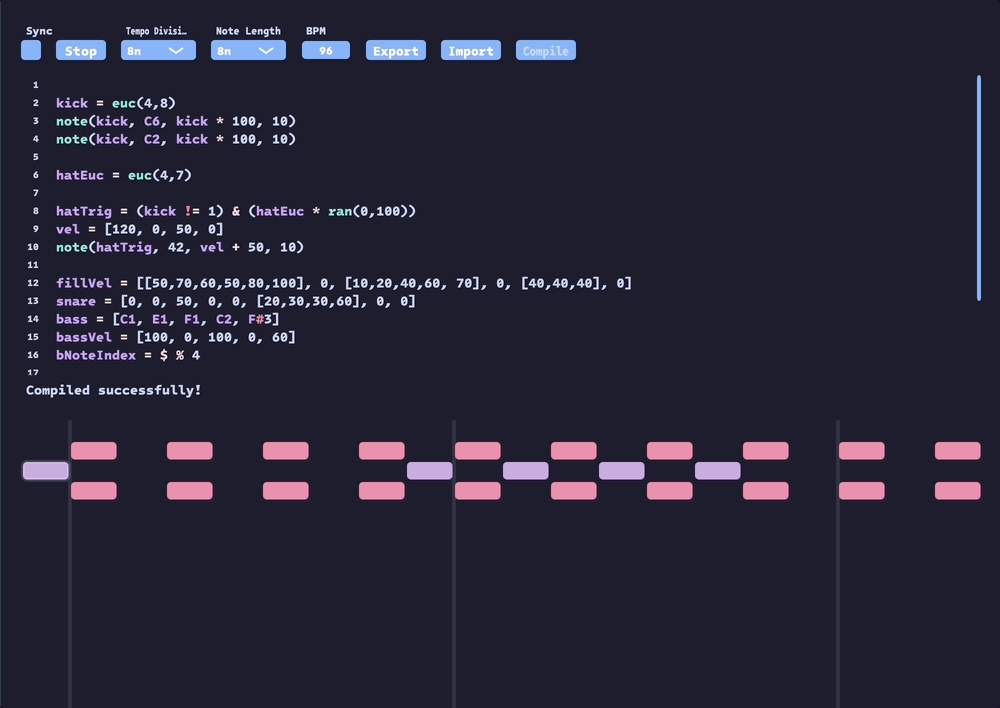

# ORchestra

[](https://github.com/Tronhjem/ORchestra/actions/workflows/Build.yml)
[](https://github.com/Tronhjem/ORchestra/actions/workflows/RunTests.yml)

> ORchestra is currently in alpha. It is pretty much feature complete, but I am still working on small fixes and bugs.

## Overview

ORchestra is a MIDI sequencer plugin that generates and combines sequences of notes or MIDI CC messages. It features a custom scripting language for creating complex rhythmic patterns through logical operations and phasing of different lengths of data. The ORchestra language does not aim to be a complete programming language; it has been created to fit the specific needs and vision for ORchestra.

There are many other live coding tools out there, and ORchestra is not trying to replace them. Rather, this is my brainchild and idea of what a fun experimental MIDI scripting language inside a DAW could be. It invites experimentation with phasing loops to create semi-algorithmic compositions or patterns.

The original prototype that sparked the idea can be found here: <https://github.com/Tronhjem/EuclidsCombinator>

> **Disclaimer:** AI has been used on this project to try out new features, such as GitHub Copilot agents, by implementing simple extensions of the language and writing unit tests, etc. The majority of the code is still written by me, and this is by no means a vibe-coded project.



---

## Table of Contents

- [Prerequisites](#prerequisites)
- [Quick Start](#quick-start)
- [Quick Usage in Major DAWs](#quick-usage-in-major-daws)
- [CMake Build Instructions](#cmake-build-instructions)
- [Testing](#testing)
- [Language Reference](#language-reference)
- [Troubleshooting](#troubleshooting)
- [License](#license)

---

## Prerequisites

Before building ORchestra, ensure you have the following installed:

- **CMake** (version 3.22 or higher)
- **C++ Compiler** with C++17 support (GCC, Clang, or MSVC)
- **Git** (for cloning and managing submodules)
- **JUCE Framework** (automatically fetched as a git submodule)

---

## Quick Start

You can run ORchestra with the Projucer. Open the `ORChestra.jucer` file in `/ORchestra/ORChestra.jucer` and generate and build the project. This is by far the easiest approach if you do not want to deal with CMake. Follow the JUCE documentation if you get stuck on how to run the project with the Projucer.

Alternatively, you can get started using the provided setup script:

```bash
./setup.sh
```

This will:
1. Initialize and update the JUCE submodule
2. Create a build directory
3. Configure CMake with default settings

Then build the project:

```bash
cd build
cmake --build .
```

---

## Quick Usage in Major DAWs

Step-by-step notes for adding ORchestra to common DAWs and routing MIDI are in [docs/usage.md](docs/usage.md).

---

## CMake Build Instructions

### Manual Build Process

**Step 1: Clone and Initialize Submodules**

```bash
git clone https://github.com/Tronhjem/ORchestra.git
cd ORchestra
git submodule update --init --recursive
```

**Step 2: Create Build Directory**

```bash
mkdir build
cd build
```

### Build Options

The CMake build supports separate compilation of the plugin and tests for faster development:

**Build tests only (no JUCE dependency, faster):**

```bash
cmake -DBUILD_PLUGIN=OFF -DBUILD_TESTS=ON ..
cmake --build .
./Tests/UnitTests/ORchestraTests
```

**Build plugin only (requires JUCE):**

```bash
cmake -DBUILD_PLUGIN=ON -DBUILD_TESTS=OFF ..
cmake --build .
```

**Build both (default):**

```bash
cmake ..
cmake --build .
```

---

## Testing

All testing tools - unit tests, fuzzers, and the multi-thread stress harness - live in the `Tests/` folder. See `Tests/README.md` for build and run instructions.

---

## Language Reference

ORchestra's scripting language, syntax, built-in functions, and examples are documented in detail in [docs/LanguageReference.md](docs/LanguageReference.md).

A browsable version of the documentation is also published at [https://tronhjem.github.io/ORchestra](https://tronhjem.github.io/ORchestra) (after GitHub Pages is enabled).

---

## Troubleshooting

### Build Issues

**Problem:** `JUCE not found` error
```
Solution: Ensure you've initialized the submodule:
git submodule update --init --recursive
```

**Problem:** CMake version too old
```
Solution: Install CMake 3.22 or higher:
- Ubuntu: sudo apt-get install cmake
- macOS: brew install cmake
```

**Problem:** Build fails with missing compiler
```
Solution: Install build essentials:
- Ubuntu: sudo apt-get install build-essential
- macOS: Install Xcode Command Line Tools
```

### Runtime Issues

**Problem:** Reserved keyword error
```
Solution: Check that you're not using: note, cc, ran, euc, bpm, beat, fn, end, return, print, test, or $ as variable names
```

**Problem:** Note name parsing error
```
Solution: Ensure note names follow the format: [A-G][#/b]?[0-10]
Examples: C4, F#5, Db3
```

**Problem:** Index out of bounds
```
Solution: Verify array indices are within range (0 to array length - 1)
```

### Getting Help

- Open an issue on [GitHub](https://github.com/Tronhjem/ORchestra/issues)
- Check existing issues for similar problems
- Include your ORchestra script and error messages when reporting bugs

---

## License

AGPLv3 - see [LICENSE](LICENSE) file for details.
